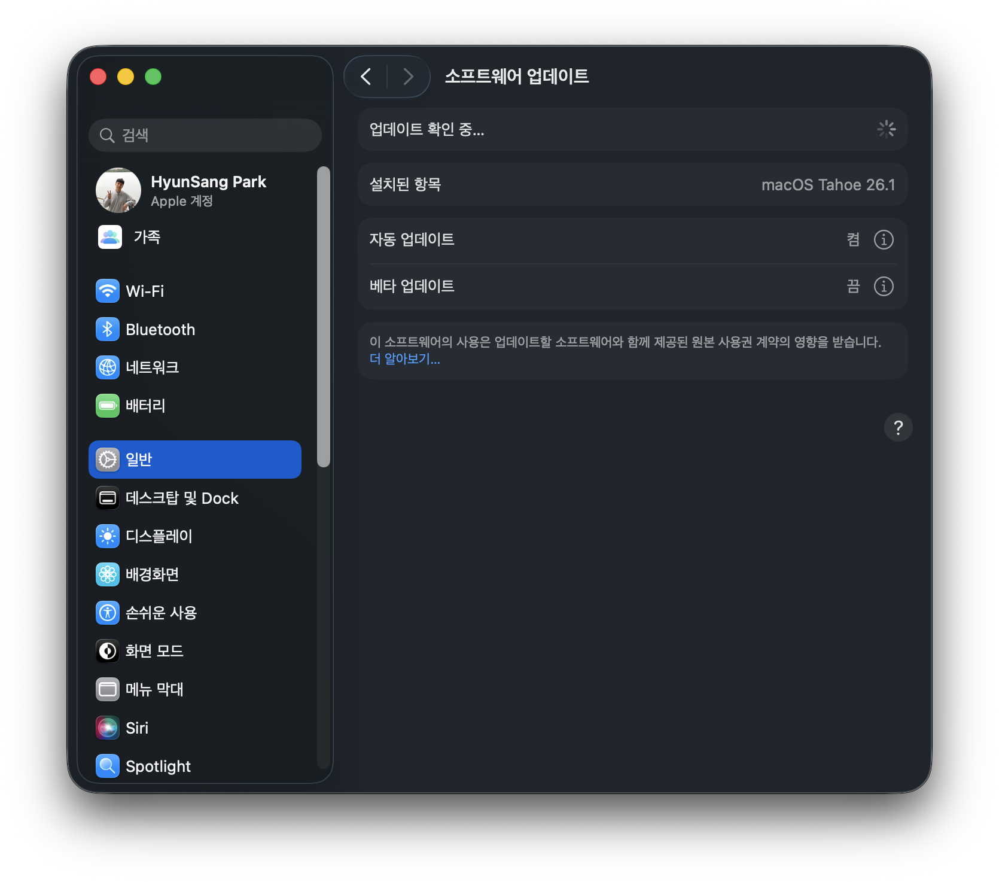

```shell
Last login: Fri Nov  7 19:11:12 on ttys003
/Users/park.hyunsang/.zshrc:15: command not found: pyenv
```

- 기존에 Hombrew를 통해서 pyenv 설치 되었으나, 맥북 소프트웨어 업데이트 이후 날라감.

```shell
➜  /opt ls -a
.  ..
```

- 소프트웨어 업데이트 이후 `/opt/homebrew` 디렉토리가 날라감.
- 변경된 내용도 확인할 수 없음. 응용 프로그램에 설치되어 있는 프로그램들도 날라감.
    - 몇 개는 공식 홈페이지에서 `.dmg` 파일을 통해서 설치하였는데도 날라감.
    - 몇 개는 Homebrew를 통해서 설치한 프로그램들도 날라감.
