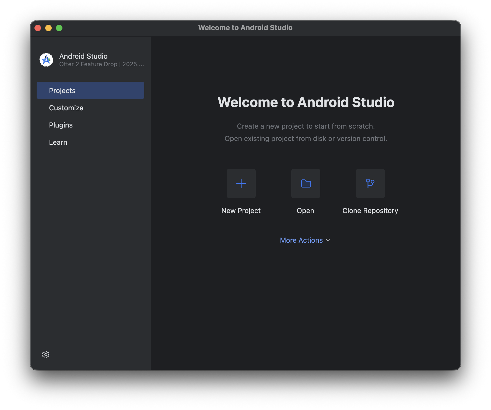
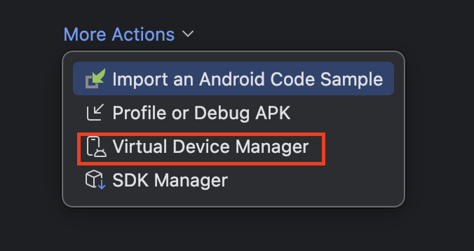
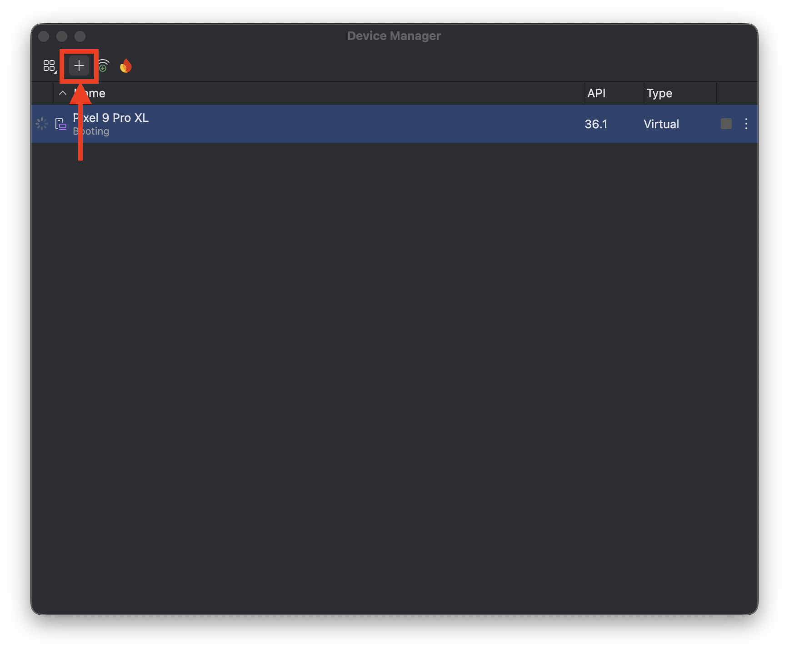
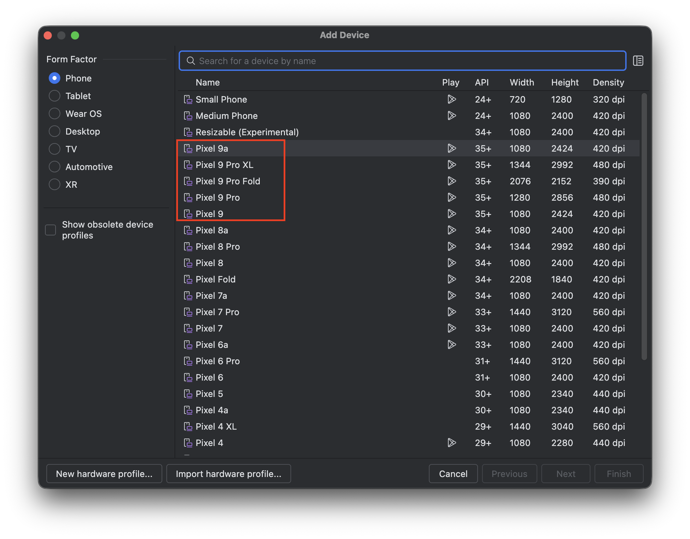
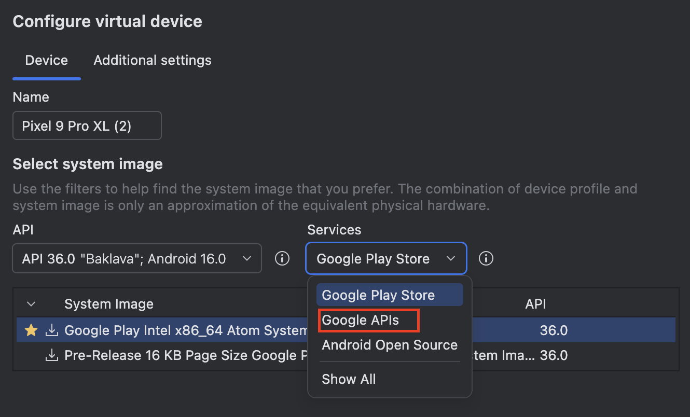
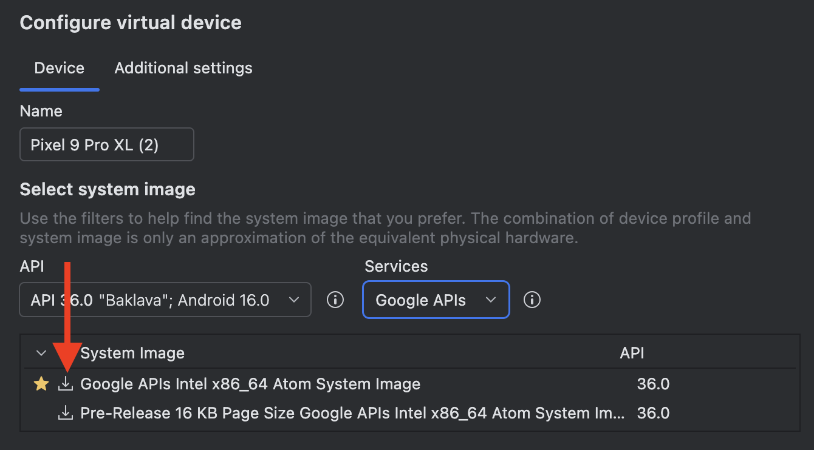

## adb 설정하기

### 1. Android Studio 설치

### 2. Hombrew를 통한 `adb(android-platform-tools)` 설치

```shell
$ brew cask install android-platform-tools
# OR
$ brew install --cask android-platform-tools
```

### 3. Virual Device 설치

- 설치 시에는 꼭 "Services"에서 "Google APIs" 선택해 주셔야 합니다.
- 













## Frida 설치

### 1. Frida CLI 설치 with PyPi

```shell
$ pip3 install frida-tools
```

Frida CLI 도구를 PyPi를 통하여 설치하였습니다.

### 2. Frida 서버 설치 및 구동

```shell
$ adb root
restarting adbd as root
$ adb push frida-server /data/local/tmp
frida-server: 1 file pushed, 0 skipped...149.9 MB/s (110713240 bytes in 0.704s)
$ adb shell "chmod 777 /data/local/tmp/frida-server"
$ adb shell "/data/local/tmp/frida-server &"
```

```shell
$ adb shell ps -e | grep frida-server
root          6122     1   10873016  41936 do_sys_poll         0 S frida-server
```

## 오류 해결 방법

```shell
$ su
/system/bin/sh: su: inaccessible or not found
$ exit

```

## 문제를 풀어보자!

### 

```java
public void onClick(View view) {
    if (challenge_01.getChall01Int() == 1) {
        MainActivity.this.completeArr[0] = 1;
    }
    if (MainActivity.this.chall03()) {
        MainActivity.this.completeArr[2] = 1;
    }
    MainActivity.this.chall05("notfrida!");
    if (MainActivity.this.chall08()) {
        MainActivity.this.completeArr[7] = 1;
    }
    MainActivity.this.changeColors();
}
```

```javascript
Java.perform(() => {
    var challenge_01 = Java.use("uk.rossmarks.fridalab.challenge_01")
    challenge_01.chall01.value = 1
});
```