안녕하세요. 박현상입니다.  
저는 독서를 개인적으로 열심히 하고자 노력하고 있습니다. 독서를 하면서 어떻게 기록하면 읽은 책들의 기억을 조금 더 인상 깊게 남길 수 있을지에 대한 고민이 항상 있었습니다.  

이러한 제 고민을 해결해 보고자 집에 있는 책들을 기록(저장)하고 관리하며, 이러한 기록들을 누군가에게 전할 수 있는 서비스를 개발하였습니다.  
일부 코드는 제가 작성하였고, 프로젝트의 기본적인 틀은 제가 작성한 코드를 토대로 Claude Code를 사용하여 바이브 코딩하였습니다.  

## 어떤 기술을 사용하였나요?

### 작성한 코드를 보고 싶으신가요?

제가 작성한 코드는 아래 링크를 통해 확인하실 수 있습니다.

- App - [Dev-HyunSang/my-own-library-app](https://github.com/Dev-HyunSang/my-own-library-app)
- Back-End - [Dev-HyunSang/my-own-library-backend](https://github.com/Dev-HyunSang/my-own-library-backend)

### App

- Flutter
    - Networking - [`Dio`](https://pub.dev/packages/dio)

**대부분의 작성된 코드는 Claude Code가 작성하였습니다.** 최대한 열심히 그리고 사용하기 편하도록 디자인을 구성하도록 노력했습니다.  
다소 부족한 부분이 있을 수도 있습니다.   

### Back-End

제가 프로젝트를 진행하면서 아래와 같은 기술을 사용하였습니다.  

- Golang on Docker
    - Framework - [`gofiber/fiber`](https://github.com/gofiber/fiber)
    - ORM(Object-Relational Mapping) - [`ent/ent`](https://github.com/ent/ent)
    - Auth - JWT(JSON Web Token)

- Infrastructure - Azure
    - VM
        - Docker with ACR(Azure Container Registry)
    - MySQL
        - 사용자의 정보를 저장, 수정, 삭제하기 위한 용도
    - Redis
        - JWT을 관리하기 위한 용도

### 어떻게 배포되나요?

모든 배포는 GitHub Actions를 통해서 배포됩니다. 커밋 시 자동으로 동작되며 도커 이미지를 빌드하고 도커 이미지를 ACR(Azure Container Registry)에 배포합니다.  
모든 환경변수는 GitHub Action의 Repository secrets에 저장되어 있으며, 이러한 환경변수를 GitHub Actions을 통해서 SSH를 통해서 서버에 직접적으로 `.env.pord`를 생성합니다.  

1. 코드 체크아웃
2. Azure Container Registry 로그인
3. Docker 이미지 빌드 & 푸시 (commit SHA + latest 태그)
    - Go언어로 작성된 백엔드 코드 빌드
4. VM에 SSH 접속하여:
   - .env.prod 환경변수 파일 생성
        - Repository secrets에 등록된 환경변수를 이용하여 생성합니다.
   - SSL 인증서 백업
   - docker-compose + nginx 설정 파일 복사
   - SSL 인증서 복원 (없으면 새로 생성)
5. 서비스 배포:
   - ACR에서 최신 이미지 pull
   - docker-compose로 서비스 재시작
   - 불필요한 이미지 정리

## 어떤 기능이 있나요?

### 회원가입

<div style="display: flex; gap: 8px; justify-content: center;">
    
</div>

- 닉네임(영어 소문자, 숫자, `_`만 사용가능 / 중복 확인)
    - Ex. `park.hyunsang` or `park.hyunsang_0625`
- 이메일 주소(인증 확인 및 중복된 메일 주소 확인)
    - 이메일 주소의 인증번호는 `사용자의 메일 주소:인증번호 6자리`로 Redis에 저장됩니다.
- 비밀번호(10~30자, 대소문자 및 숫자, 특수문자 포함)
    - 데이터베이스에 저장 시 암호화 / 서버 내에 로그 X
- 비밀번호 확인(10~30자, 대소문자 및 숫자, 특수문자 포함)
- 이용약관 동의 여부(미동의 시 회원가입 불가)

#### 닉네임 중복 여부 및 유효성 검사

<div style="display: flex; gap: 8px; justify-content: center;">
    
    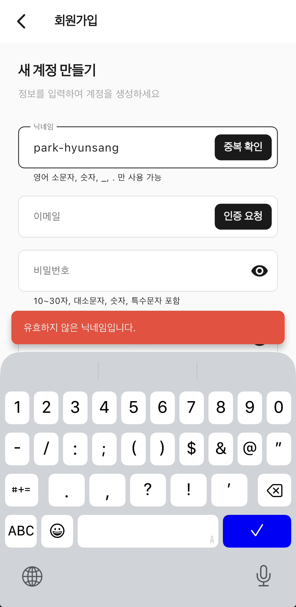
    
</div>

- 새롭게 회원가입 하는 사용자의 닉네임의 중복 여부 및 유효성 검사를 확인할 수 있도록 만들었습니다.
    - 동일한 닉네임을 사용하는 사용자가 있는 경우 중 이미 사용 중인 닉네임이라는 문구를 보여줍니다.
    - 닉네임에 사용불가한 문자가 들어간 경우 유효하지 않은 닉네임이라는 문구를 보여줍니다.

#### 메일 주소 인증

<div style="display: flex; gap: 8px; justify-content: center;">
    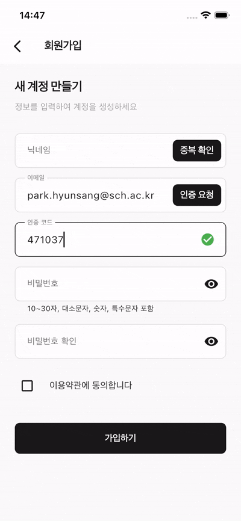
    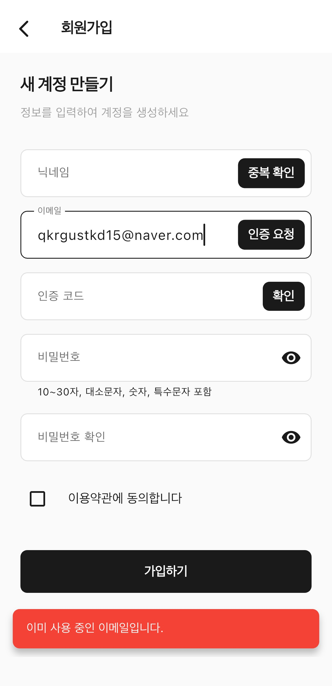
</div> 

<div style="display: flex; gap: 8px; justify-content: center;">
    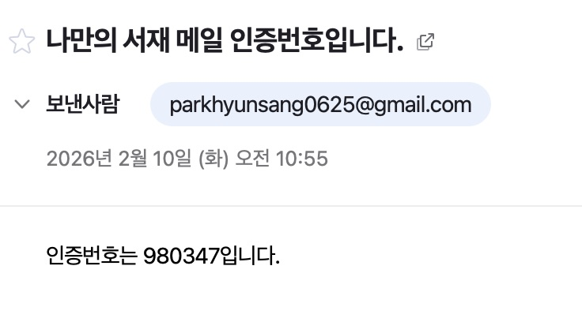
</div> 

- 사용자가 자신이 사용하는 메일 주소를 입력하여 실제 접근할 수 있으며 사용 가능한 메일인지 확인합니다.
- 사용자의 메일 인증 시 무작위 숫자 6자리를 메일로 보내며, 인증번호의 유효시간은 5분입니다.
    - 요청한 메일 주소와 인증번호가 Redis에 저장됩니다.
    - 인증번호 요청을 동일한 메일 주소로 5분 이내로 요청하는 경우 서버에서 인증번호 메일을 보내지 않습니다.  
    - 정상적으로 회원가입이 가능된 경우 Redis에 저장된 정보는 자동적으로 삭제됩니다.
- 이미 가입한 사용자가 사용하는 메일 주소를 회원가입 시 입력 시 회원가입을 할 수 없도록 하였습니다.
- 회원가입 중 인증 절차를 정상적으로 걸치지 않은 경우 서버에서 회원가입이 불가능하게 막아두었습니다.  

**인증 절차가 완료되지 않은 경우:**

```json
{
  "id": "270bb822-9c04-47a4-bcea-d590c8e1173d",
  "email": "park.hyunsang@sch.ac.kr",
  "code": "585559",
  "expires_at": "2026-02-12T08:10:03.178749127Z",
  "is_verified": false,
  "created_at": "2026-02-12T08:05:03.178751052Z"
}
```

**인증 절차가 완료된 경우:**

```json
{
  "id": "270bb822-9c04-47a4-bcea-d590c8e1173d",
  "email": "park.hyunsang@sch.ac.kr",
  "code": "585559",
  "expires_at": "2026-02-12T08:10:03.178749127Z",
  "is_verified": true,
  "created_at": "2026-02-12T08:05:03.178751052Z"
}
```

#### 서비스 이용약관 동의

<div style="display: flex; gap: 8px; justify-content: center;">
    
    
</div>

<div style="display: flex; gap: 8px; justify-content: center;">
    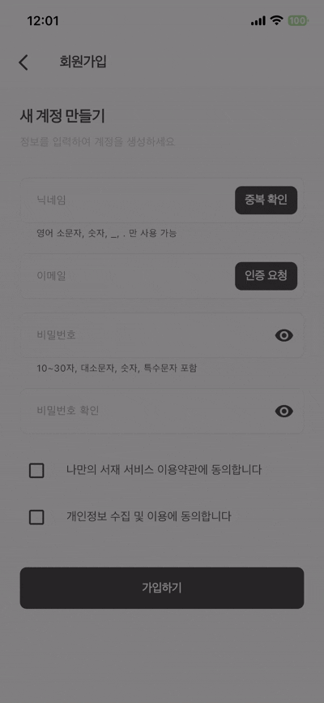
</div>

- 사용자가 서비스 이용약관 및 개인정보 이용 동의을 확인하고 동의할 수 있도록 하였습니다.
    - 사용자가 서비스 이용약관 동의하지 않은 경우 서비스를 사용할 수 없다고 알려줍니다.
    - 서버에서도 사용자가 동의하지 않은 경우 회원가입이 진행되지 않습니다.

### 로그인

<div style="display: flex; gap: 8px; justify-content: center;">
    
    
</div>

<div style="display: flex; gap: 8px; justify-content: center;">
    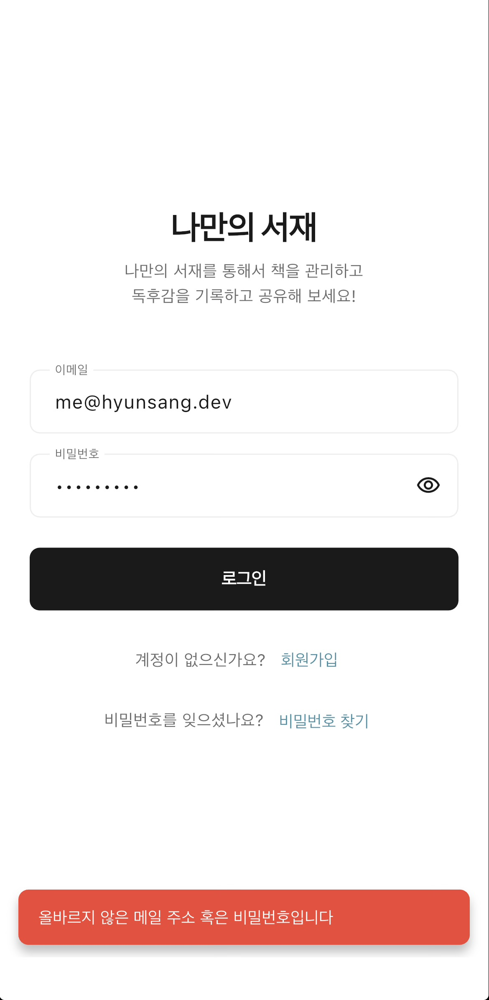
</div>

- 사용자가 입력한 메일주소와 비밀번호를 입력하여 로그인 할 수 있도록 하였습니다.
    - 입력한 메일주소 혹은 비밀번호가 올바르지 않은 경우 오류 메시지를 통해서 사용자에게 알려줍니다.

### 비밀번호 찾기

<div style="display: flex; gap: 8px; justify-content: center;">
    
    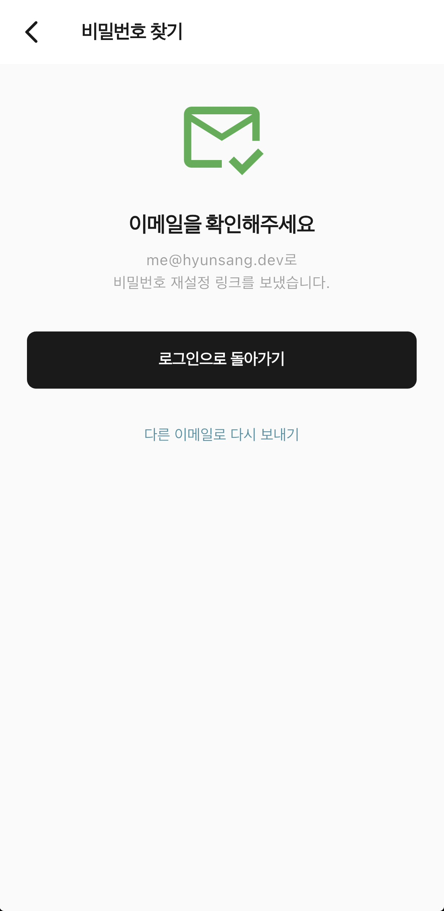
</div>

<div style="display: flex; gap: 8px; justify-content: center;">
    
</div>

<div style="display: flex; gap: 8px; justify-content: center;">
    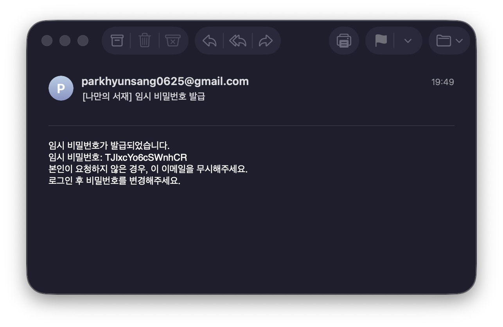
</div>

- 사용자가 비밀번호를 잊어버린 경우 '비밀번호 찾기' 기능을 통해서 임시 비밀번호를 사용자가 생성한 계정의 메일 주소로 받아볼 수 있습니다.

### 책 등록 · 수정 · 삭제

책 등록은 손쉽게 책의 ISBN 바코드를 이용하여 책을 손쉽게 등록할 수 있도록 하였습니다.  
카메라를 이용하여 책 뒤편에 있는 ISBN 바코드를 스캔하면 자동적으로 책 제목과 저자가 입력됩니다.  

<div style="display: flex; gap: 8px; justify-content: center;">
    
    
</div>

<div style="display: flex; gap: 8px; justify-content: center;">
    
</div>

<div style="display: flex; gap: 8px; justify-content: center;">
    
    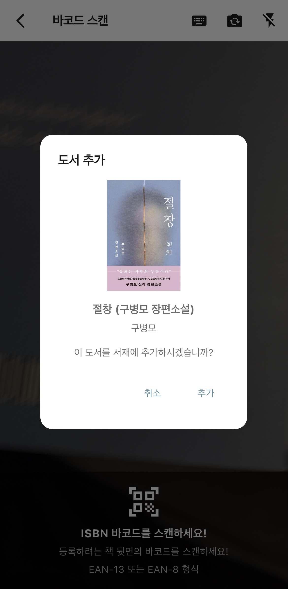
</div>

<div style="display: flex; gap: 8px; justify-content: center;">
    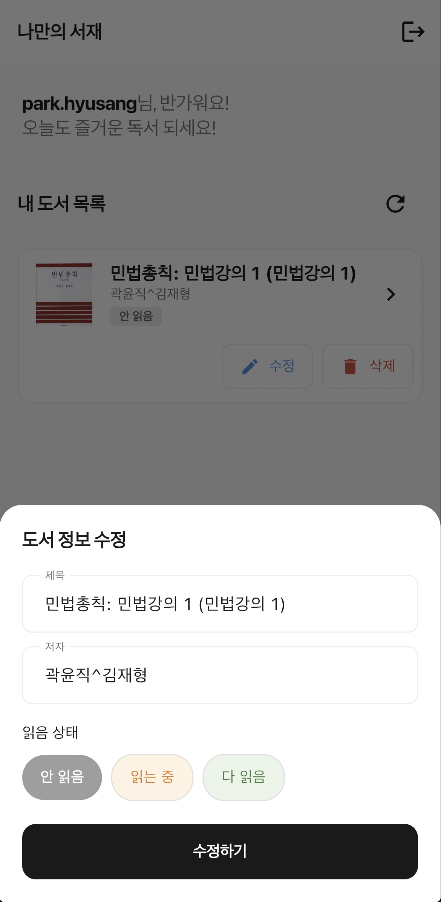
    
</div>

- 사용자가 등록하려는 책 뒤편에 있는 ISBN 바코드를 인식하면 손쉽게 책 정보를 불러올 수 있습니다.
    - 사용자가 해당 책이 정확하게 맞는지 확인한 후 추가 버튼을 누르는 경우 책을 저장할 수 있습니다.
- 등록된 책의 항목을 확인하고 '수정' 버튼를 통해서 책의 정보를 손쉽게 수정할 수 있습니다.
    - 책 제목 / 저자 / 독서 상태를 사용자가 손쉽게 수정할 수 있습니다.

#### 등록 기능을 개발하면서의 고민

ISBN 바코드를 통해서 정보를 가져오기 위해선 API를 사용해야한다고 생각했습니다.  
찾아보던 도중 네이버 API를 사용하면 ISBN를 통해서 검색할 수 있는 기능을 만들었습니다.  
사용자가 바코드를 인식하면 백엔드 단계에서 요청을 받아서 네이버 API를 통해서 데이터를 조회하여 해당 데이터를 가공하여 저장하는 기능입니다.  

실제 데이터는 아래와 같이 구성되어 있습니다.   

1. 사용자가 ISBN 바코드를 스캔 시 바로 서버에서 네이버 검색 API를 통한 책 검색 요청
3. 네이버 책 검색 API 응답된 항목을 JSON 구조체로 Unmarshal함
4. Unmarshal한 내용을 최종적으로 Serving함.
    - 추가 시 추가 기능의 API로 해당 정보를 넘김, 최종 저장

**Request:**

- Authorization: Bearer {token} 필요

```json
{
  "book_isbn": "9791198375308"
}
```

**Response:**

```json
{
    "data": {
        "lastBuildDate": "Fri, 13 Feb 2026 15:25:35 +0900",
        "total": 1,
        "start": 1,
        "display": 1,
        "items": [
            {
                "title": "데일 카네기 긍정태도론",
                "link": "https://search.shopping.naver.com/book/catalog/58613072002",
                "image": "https://shopping-phinf.pstatic.net/main_5861307/58613072002.20260123091146.jpg",
                "author": "데일 카네기",
                "discount": "15210",
                "publisher": "현대지성",
                "pubdate": "20260202",
                "isbn": "9791139729528",
                "description": "▶100년 만에 처음 공개되는 데일 카네기 미발표 원고 최초 공개\n\n성실한데 인생이 안 풀린다면, 실력보다 당신의 태도를 확인하라\n\n1930년대 대공황, 실업과 파산의 공포가 미국 전역을 덮쳤을 때, 데일 카네기는 매일 밤 라디오를 통해 수천만 청취자의 심장에 ‘희망의 엔진’을 달아주었다. 이 책은 그가 전설적인 베스트셀러 『인간관계론』을 집필하던 시기, 라디오 방송을 통해 대중에게 반복적으로 전했던 가장 생생하고 실천적인 성공 원칙을 담은 미발표 원고다.\n\n“나는 남보다 일찍 출근하고, 더 늦게까지 일하는데 왜 이렇게 상황이 달라지지 않을까?” 카네기는 수만 명의 사례를 통해 다른 결론에 도달했다. 전문 지식이 성공에 미치는 영향은 15퍼센트에 불과했다. 나머지 85퍼센트는 태도였다. 사람을 대하는 태도, 문제를 바라보는 태도, 위기 앞에서 움직이는 태도였다. \n책에 등장하는 제이슨 휘트니는 고등학교도 졸업하지 못했다. 그는 정육점 직원으로 출발했다. 그러나 그는 주어진 일만 잘하지 않았다. 회사의 문제를 먼저 보았다. 자기가 속한 치즈 부서를 없애자고 제안한 사람은 바로 그였다. 자신의 자리를 지키는 대신, 회사의 이익을 택했다. 그 선택이 결국 그를 크래프트 피닉스 치즈사의 사장으로 만들었다. \n찰스 월그린의 출발은 더 낮았다. 주머니에는 4센트(약 50원)밖에 없었다. 하지만 고객의 숨은 욕망을 읽어내는 태도 하나로 500개 약국의 오너가 되었다. 그는 약만 파는 대신, 고객에게 ‘관심’을 팔았다. 전화 주문을 받으면 일부러 수다를 떨며 시간을 끄는 사이 직원을 전력 질주시켜, 전화를 끊기도 전에 초인종이 울리게 하는 마법 같은 서비스를 제공했다. 고객은 그 경험을 잊지 않았다. \n앨리스 푸트 맥두걸은 마흔 살에 빈털터리가 되었고 아이 셋을 혼자 키워야 했다. 그녀의 자본은 겨우 38달러(약 5만 원)였다. 비가 와서 손님이 끊긴 어느 날, 절망하는 대신 와플을 구워 무료로 나눠주며 위기를 기회로 바꿨다. 그녀는 ‘나이’나 ‘자본’을 탓하는 대신, 끝까지 밀어붙이는 태도로 200만 달러(구매력 가치로 현재 약 500억 원 가치)의 자산가가 되었다. 그 태도가 곧 사업 모델이 된 것이다. \n이들의 공통점은 재능이 아니다. 운도 아니다. 상황을 대하는 태도였다. 인생이 풀리지 않는 이유는 노력이 부족해서가 아니다. 노력의 방향이 틀렸기 때문이다. 이 책은 성실함이 헛돌지 않게 만드는 태도의 사용 설명서다.\n\n\n“카네기 코스는 내 인생을 바꾼 최고의 투자!” _워런 버핏 \n그 카네기 코스의 원형(Original)이 담긴 원고  \n\n워런 버핏은 젊은 시절, 대중 앞에 서는 것조차 두려워하던 소심한 청년이었다. 그런 그를 세계적인 리더로 바꾼 것은 대학 졸업장이 아니라 ‘데일 카네기 코스’였다. 버핏은 자신의 사무실에 대학 졸업장 대신 카네기 수료증을 걸어두고 “내 인생 최고의 투자”라고 말한다.\n워런 버핏은 왜 수십억 달러 가치가 있는 투자 비법보다 카네기 코스를 자신의 최고 투자 중 하나로 꼽았을까? 그것은 카네기의 가르침이 ‘지식’이 아니라 ‘삶을 대하는 자세’를 바꿔주었기 때문이다. 이 책은 그렇게 버핏을 변화시킨 전설적인 강의의 씨앗이 된 원고다. 카네기 코스가 체계화되기 전, 그가 대중과 가장 밀접하게 소통하며 전했던 핵심 철학들이 고스란히 녹아 있기 때문이다. \n\n비난하고 싶은 충동을 억누르고 편지를 서랍 속에 넣어둠으로써 훗날의 화를 피한 링컨의 지혜부터, 단 한 번 만난 고객의 이름을 12년 뒤에도 기억해 호텔 경영권을 제안받은 존 호건의 이야기까지. 이 책은 단순한 조언집이나 성공담이 아니다. 사람을 얻는 방식, 기회를 만드는 방식, 인생의 방향을 바꾸는 태도의 기준을 제시한다. \n지금 점검해야 할 것은 실력이 아니다. 태도다. 인생은 이미 그 지점에서 갈리고 있다."
            }
        ]
    },
    "is_success": true,
    "responsed_at": "2026-02-13T06:25:35.401895027Z"
}
```

### 책 리뷰

책 리뷰는 등록된 책을 리뷰할 수 있는 기능입니다. 다른 사용자가 작성한 리뷰을 공유할 수 있는 기능입니다.  

<div style="display: flex; gap: 8px; justify-content: center;">
    
    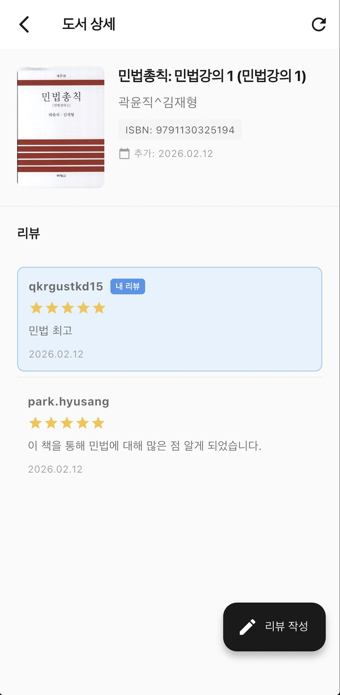
</div>

<div style="display: flex; gap: 8px; justify-content: center;">
    
    
</div>

- 홈 화면에서 등록된 책을 리뷰를 등록할 수 있으며, 내 리뷰 페이지에서 수정 및 삭제가 가능합니다.
    - 별점 / 내용 / 다른 사용자에게 리뷰 공개 여부를 작성 및 선택할 수 있습니다.

### 사용자 닉네임 변경

<div style="display: flex; gap: 8px; justify-content: center;">
    
    
</div>

- 저장된 닉네임을 불러옵니다. 사용자가 변경 시에만 '중복 확인' 버튼만 보입니다.
    - 중복 확인 및 유효성 검사 후 최종 변경 완료 됩니다.

### 비밀번호 변경

<div style="display: flex; gap: 8px; justify-content: center;">
    
    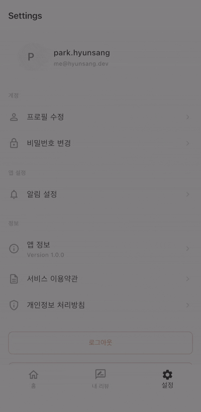
</div>

- 사용자가 비밀번호를 변경할 수 있는 기능입니다.

### 회원탈퇴

<div style="display: flex; gap: 8px; justify-content: center;">
    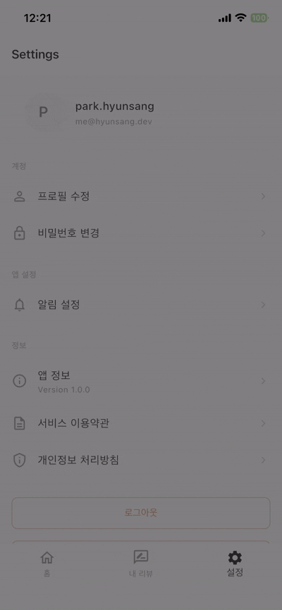
</div>

- 회원탈퇴 기능은 회원이 '나만의 서재'를 탈퇴할 때 사용하는 기능입니다.
    - 회원정보, 등록된 책, 등록된 책의 리뷰 등의 사용자 정보가 일괄적으로 삭제됩니다.

## 프로젝트를 진행하면서 느꼈던 점들

이번 프로젝트에선 군 복무하면서 '바이브 코딩'을 너무나도 해보고 싶었던 제게 일부분의 기술적 갈망을 해결 시켜준 것 같습니다.  
어떻게 쓰면 더 효율적이고 보안 측면에서 안전하게 사용할 수 있을지 등에 대한 궁금함이 항상 있었습니다.  
앞으로 "코딩"이라는 관점이 바뀔 것 같다라는 생각도 해보곤 합니다. 기술적 부채와 기술과 관련된 수많은 고민과 비용이 바이브 코딩의 도움을 통해서 일부분 해결되리라 생각합니다.  

이번 사이드 프로젝트를 통해서 제 기술의 역량을 알게 되었고, 프로젝트를 통해서 아직도 공부해야할 부분이 있다는 점도 알게 되었습니다.  
일부분 기술적 갈망을 잘 도와준 Claude Code에 대해서 더 열심히 공부하며 잘 사용해 볼 수 있도록 노력하겠습니다 :-)  

## Contact Me

저는 다양한 경험을 추구합니다. 저는 모르는 부분을 알기 위해 노력하며, 모르는 부분을 채워나가기 위해 노력하고 있습니다.
개발자로서, 학부생으로서 제가 속한 집단에서 제가 모르는 부분을 알고 배울 수 있음에 항상 감사하고 있습니다.  
제게 소중하고 다양한 경험을 시켜주실 분들을 찾고 있습니다. 아래 연락처로 연락 주시면 감사하겠습니다.

- Email - [me@hyunsang.dev](mailto:me@hyunsang.dev) or [park.hyunsang@sch.ac.kr](mailto:park.hyunsang@sch.ac.kr)
- Linkedin - [@parkhyunsang](https://www.linkedin.com/in/parkhyunsang/)