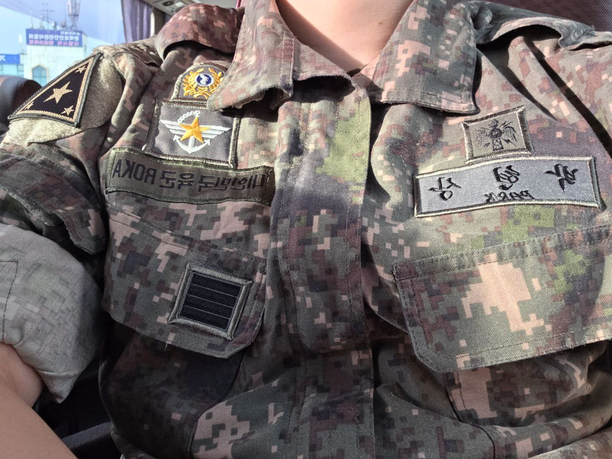

안녕하세요. 박현상입니다.  
2024.03.18. 논산 육군훈련소로 정보보호병(175.104)로 입대하여, 2025.09.17. 제대하였습니다.  
저는 육군본부에서 군복무를 하였고, 군생활하면서 본부 병력 통합관리로 인해서 근무지 조회를 하면 계룡대근무지원단으로 떴지만 근무지는 육군본부였습니다.

> **업무상 취득하였던 군사보안 관련된 정보는 작성하지 않았습니다.**

## 내가 했던 업무와 경험들

육군훈련소와 정보통신학교에서의 기본적인 훈련과 교육을 마치고 자대인 육군본부로 배치 받았습니다.
육군훈련소에서 면접을 통해 선발되었으며, 육군본부로 배치받게 되었습니다.

제가 했던 업무는 CERT(Computer Emergency Response Team) 업무였으며, 저희 사무실은 24시간 연중무휴로 돌아가고 있습니다.  
그러다 보니 다소 피곤했던 날들도 많았지만, 누군가는 제가 하고 있는 업무를 해야하며 누군가에게 도움이 되고 있다는 생각을 하면서 기쁜 마음으로 임무수행 했던 것 같습니다.  
'25년 신년을 저는 사무실에서 지냈으며, 타종도 사무실에서 들었습니다.

다루었던 체계(장비)는 UTM, TMS, SIEM, SOAR(도입과정), NAC 등을 다루었고, 각종 훈련 시 상황실 구성도 간부님과 함께 하였습니다.
선임·후임들도 다 좋았고, 제가 병장이었을 땐 다 같이 친구처럼 지낼 수 있는 분위기를 만들고자 노력했습니다.  
간부님들과 주무관님들이 항상 제게 했던 말은 긍정적인 모습이 보여서 보기 좋다고 하셔서 군복무를 하면서 긍정적으로 살아가면 좋겠다라는 생각을 하고 열심히 실천하고 있습니다.

생각보다 근무를 하면서 전화가 많이 옵니다. 일반 사용자(육군 전체)부터 예하 제대의 사이버방호실, 타군 사이버작전센터(사이버방호실)에서도 전화가 많이 옵니다.  
관제를 하면서 혹은 훈련을 하면서 침해사고에 대해서 대응하고 있는데, 전화가 많이 와서 관제 업무를 할 때 힘들었던 점이 다소 많았지만 그래도 슈퍼킹긍정 마인드로 잘 도와드렸습니다.

지시, 지시에 대한 확인, 보고 등의 일련의 업무가 다소 복잡했을 때도 많고 어려울 때도 많았지만 긍정적인 마인드를 가지고 잘 처리하였습니다.  
사이버작전사, 육직 사령부 및 학교기관(육군사관학교, 3사관학교), 지작사(군단, 사단), 2작전사(사단) 등과 같이 사이버방호임무를 하였습니다.  
군생활하면서 사회에서 개인정보 유출이 심각한 문제로 발달되어서 군 내부적으로도 개인정보 유출 사고가 나지 않도록 점검하였습니다.

### 2025 사이버공격방어대회 공공부 본선 진출

좋은 기회로 사이버공격방어대회 본선에 진출하게 되었습니다. 국군통신사령부와 육군본부(계근단)이 함께 나가였습니다.  
작년에도 참가하였지만 예선에서 탈락해서 본선 진출을 못 하였는데, 올해에는 대회 규정 바뀌어서 본선에 진출할 수 있었습니다.  
전역 6일 전에 참가하여 좋은 경험을 할 수 있었습니다. 팀원들 소속이 저희 부대소속이 아니라 타소속이라서 행정처리하는데 조금 힘들었지만
대대와 사무실에서 행정처리를 잘해 주셔서 참가할 수 있었습니다.  
공공부에서 다양한 경험을 할 수 있었고, 처음 접해보는 문제 방식이 있어서 좋은 경험을 할 수 있었습니다.

## 군복무 중 느꼈던 생각들

상급부대에서 복무하면서 많은 점들을 배울 수 있었습니다. 저보다 뛰어난 간부님들과 선·후임들을 볼 수 있었고 보면서 제 자신에게 많은 귀감이 되었습니다.  
전역하고 앞으로 어떻게 살아가야할지, 어떤 방향으로 내 자신을 발전시키며 우리 사회에 잘 적응할 수 있을지, 학업 등에 대해서 많은 고민을 하였고, 간부님들과 주무관님들의 조언을 얻으면서 제가 앞으로 살아갈 방향에 대해서 생각할 수 있었습니다.

부정적인 생각보단 긍정적인 행실을 통해서 내 자신만 행복하는 것이 아닌 타인에게도 행복을 전할 수 있는 사람이 되기 위해 노력했습니다.
누군가가 하지 않은 일을 내가 먼저 나서서 하고자 노력했습니다. 못한 것들도 있지만, 최대한 제 자신이 하고자 하였습니다.

군복무하면서 책을 많이 읽었습니다. 어려운 책들은 완벽히 읽진 못 했지만 소설을 많이 읽었습니다.
법을 공부하고 싶어서 민법에 대해서 공부하였고, 민법총칙과 관련된 판결(신의성실, 권리 등)도 많이 읽고 공부하였습니다.
민법을 공부하면서 느끼는 점은 법은 분야를 가리지 않고, 모든 분야에서 법이 쓰인다는 사실을 알게 되었습니다.
앞으로도 열심히 정진하며 열심히 공부하면서 살겠습니다!

## 전역 이후엔

아마도 본전공인 정보보호를 공부하면서 부전공으로 법학을 공부할 듯 합니다.  
변호사가 되고 싶기에 열심히 공부하고 노력해서 로스쿨에 진학하고자 합니다.  
로스쿨에 못 가더라도 제가 하고 싶은 일, 그리고 행복한 일을 하기 위해서 열심히 긍정적으로 충실하게 살고자 합니다 :)  
제 조국, 대한민국을 현재도 보이지 않은 곳에서 묵묵히 자신의 임무에 충실하며, 대한민국을 지키고 있는 분들의 헌신에 감사를 표합니다.
