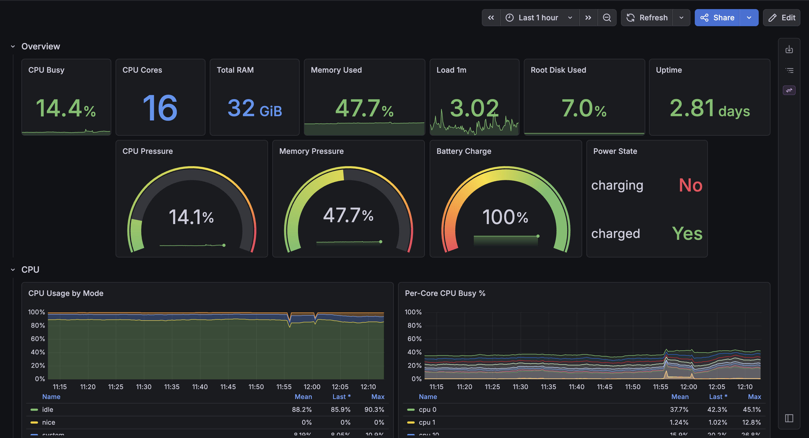
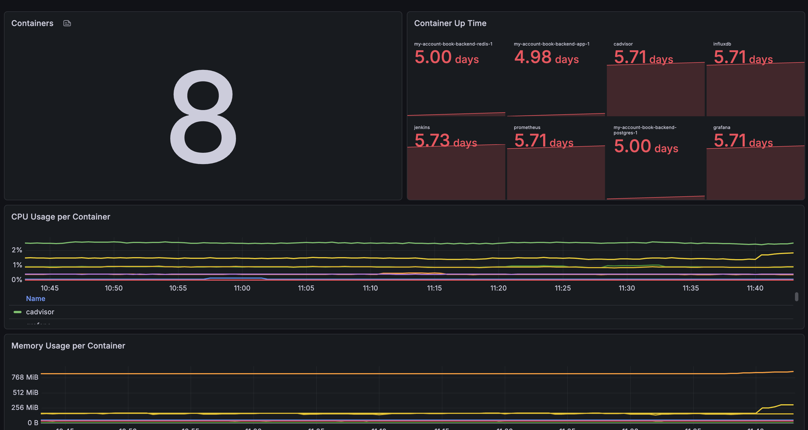
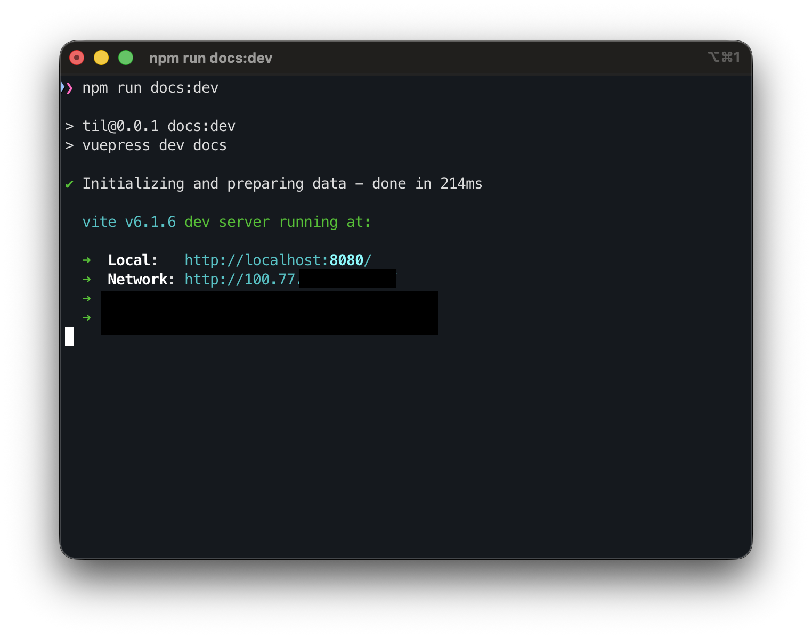

안녕하세요. 박현상입니다.  
어쩌다보니 맥북을 바꾸게 되었습니다. 기존에 사용하고 있던 19년형식 인텔 맥북을 홈 서버로 사용하게 되었습니다.  
사용하다 보니 안전하게 외부에서 접근할 수 있는 방법을 찾던 도중 Tailscale에 대해서 알게 되었고, Tailscale를 사용하게 된 계기를 서술합니다.  

## 요건

- VPN으로만 VNC, SSH 등으로만 접근
- VPN을 통해서 GitHub Action을 통한 Docker에 배포
- 포트포워딩이 필요없이 원격 접근할 수 있도록 구현

## Tailscale으로 사용하기

VPN를 손쉽게 사용할 수 있는 플랫폼이 무엇이 있을까 찾던 도중 Tailscale를 찾게 되었습니다.  
제가 Tailscale를 사용하게 된 이유는 아래와 같습니다.

1. 별도의 VPN 서버를 구축하지 않아도 됩니다.
    - 사용자가 원한다면 컨트롤 서버를 자체적으로 구현할 수 있습니다.
2. 손쉬운 접근 및 설정
    - 1번 항목과 비슷한 맥락입니다. Tailscale이 자체적으로 사용자 친화적으로 기본적인 설정을 손쉽게 할 수 있습니다.
    - **공유기에서의 포트포워딩과 같은 설정이 없어도 사용할 수 있습니다.**

개인적으로 공유기에서 포트포워딩을 하지 않고 Tailscale만 있다면 서버로 사용하고 있는 맥북에 접근할 수 있다는 매력이 너무나도 좋았습니다.

### 설치 방법

mac의 경우 App Store에서 설치 후 사용할 수 있습니다. 혹은 [Tailscale 공식홈페이지](https://tailscale.com/download)에서 다운로드 후 사용하실 수 있습니다. Homebrew 명령어를 통해서도 설치하실 수 있습니다.  

```bash
brew install tailscale
```


Tailscale CLI를 사용하고 싶으신 경우 `.zshrc` 혹은 `.bashrc` 설정에 아래와 같은 명령어를 추가하시면 사용하실 수 있습니다.

``` bash
alias tailscale="/Applications/Tailscale.app/Contents/MacOS/Tailscale"
```

## 제 서버에서는?

몇 개의 프로그램을 제외하곤 서버는 Docker 상에서 구현/구동되고 있습니다.  

- Grafana
- Prometheus
    - cAdvisor
    - Node Exporter(Local)
- Vaultwarden
    - 구축 예정 / 현재는 1Password 사용 중
- Tailscale
    - Tailscale를 사용하면서 `Exit Node` 기능을 사용하고 있습니다. 제 맥북과 핸드폰의 트래픽은 홈 서버을 걸쳐서 트래픽이 나가게 설정 되어있습니다.
- OpenClaw
    - 캘린더, 애플 리마인더, 메일 등 각종 개인적으로 필요한 것들이 연결되어 있습니다.





Grafana에 Prometheus로 cAdvisor와 Node Exporter(Local)에 등록되어 있습니다.  
Grafana에서는 Prometheus를 통해서 cAdvior와 Node Exporter를 통해서 다양한 환경에서의 CPU, Memory, Disk, Up Time 등의 상태를 볼 수 있게 구현해 두었습니다.  

제가 외부에서 맥북을 사용할 때 모든 트래픽은 제 홈서버를 통해서 통신이 나가도록 되어있습니다.
Exit Node 기능을 아주 잘 사용하고 있습니다.  Exit Node에 대해서 더 알아보고 싶으시다면 [Tailscale - Exit node (route all traffic)](https://tailscale.com/docs/features/exit-nodes)을 살펴보시면 됩니다.  
AWS와 Azure에서도 Tailscale를 사용하실 수도 있습니다.  

### Tailscale IP 주소를 통한 접근



Vite를 로컬에서 실행시키면 Tailscale IP주소도 자동적으로 바인딩 됩니다.  
Tailscale IP주소를 통해서 VPN이 연결되어 있다면 접근할 수 있습니다.

## 앞으로

작지만 소중한 홈 서버를 통해서 다양한 것들을 해 보고자 합니다.  
이런저런 것들을 만들고 사용해 보겠습니다...ㅎㅎ  
다음 글에선 홈 서버에 제가 만든 서비스를 어떻게 효율적으로 배포할 수 있을지에 대한 글을 작성하겠습니다.  

## 참고한 자료

- [Tailscale로 어디서든 내 기기에 안전하게 접속하기](https://daleseo.com/tailscale/)
- [Tailscale VPN 실무 가이드: 설치부터 운영까지의 실전 구성 방법](https://rupijun.tistory.com/entry/Tailscale-VPN-%EC%8B%A4%EB%AC%B4-%EA%B0%80%EC%9D%B4%EB%93%9C-%EC%84%A4%EC%B9%98%EB%B6%80%ED%84%B0-%EC%9A%B4%EC%98%81%EA%B9%8C%EC%A7%80%EC%9D%98-%EC%8B%A4%EC%A0%84-%EA%B5%AC%EC%84%B1-%EB%B0%A9%EB%B2%95)
- [VPN 구성하고 내 삶에 응용하기 1 - Tailscale 설치 및 설정](https://will2world.com/oh-my-server/tailscale/)