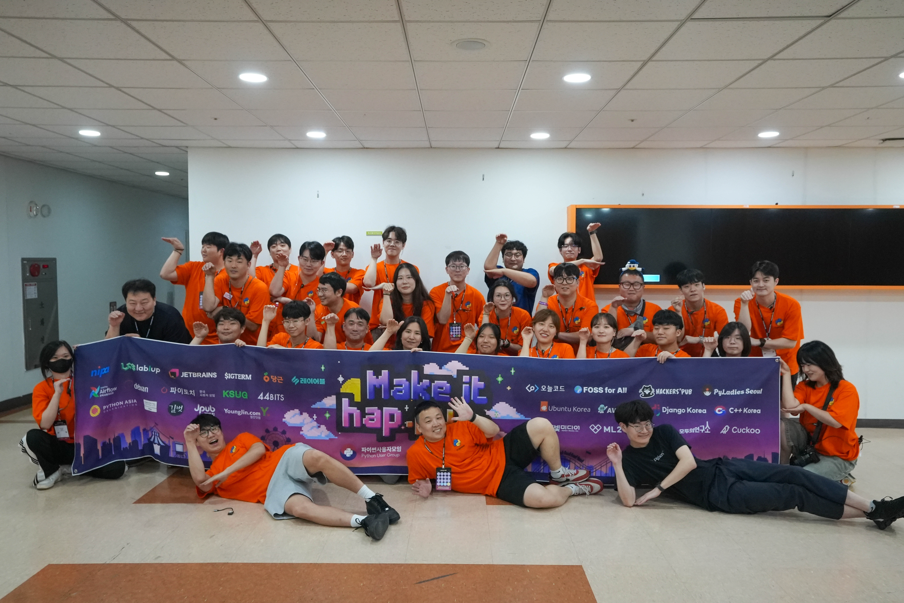

안녕하세요. 박현상입니다.  
저는 올해 초 파이콘준비위원회에 지원하였고, 합격하여 많은 파이콘준비위원회 분들과 함께 PyCon Korea 2026을 함께 준비하였습니다.  
PyCon Korea 2026에서 처음 신설된 미디어팀에서 리드로서 행사에 참여하시는 다양한 분들이 보다 쉽게 행사를 즐길 수 있도록 장비 대여부터 장비 세팅, 송출, 후원사 인터뷰 등을 통해서 보다 포괄적으로 PyCon Korea 2026의 모습들을 녹아낼 수 있도록 노력하였습니다.  

사실 미디어팀이 올해 처음으로 신설되어서 새롭게 도전하는 부분들이 많았고, 그러한 부분들을 제가 챙기고 살펴보느라 다른 팀에서 활동하지 못해서 슬프지만, 그래도 한 팀에서 온전한 일을 할 수 있었음에 감사함을 느끼고 있습니다.

438명의 참석자 분들과 함께 재밌고, 알찬 세션들 속에서 많은 정보를 얻을 수 있고, 교류할 수 있는 장이 되었습니다.  
저는 PyCon Korea 2026에서 미디어팀에서 리드로 활동하면서 행사장의 화면 및 음향 관리를 하였고, 발표자 분들께서 발표를 더 많은 분들이 보실 수 있도록 세션장의 화면을 구성하고 송출하는 활동, 행사장의 모습을 영상으로 촬영하는 등의 활동을 하였습니다.

제가 파이콘준비위원회에서 합류하면서, 그리고 개발자 커뮤니티를 활동하며, 많은 부분들을 제가 알게 되었습니다.  
"커뮤니케이션"이라는 부분에 항상 관심이 많고, 어떻게 하면 더 좋은 방향으로 서로의 공동의 목표에 접근할 수 있을지에 대한 고민이 많았던 것 같습니다.  
이러한 부분에 있어서 역량을 많은 분들과 함께 공동의 목표에 대한 방법들을 논의하면서 더 가까이 접근할 수 있었고, 보다 성숙해진 커뮤니케이션 능력을 얻게 된 것 같습니다.

공동의 목표를 향해 나아가면서 혼자했다면 절대로 이루어내지 못 했을텐데, 함께 도와주신 준비위원회 구성원 분들 덕분에 올해 행사도 잘 마무리 할 수 있었습니다.  
내년 PyCon Korea 2027, 그리고 파이콘준비위원회에도 많은 관심과 사랑 부탁드리겠습니다.  

