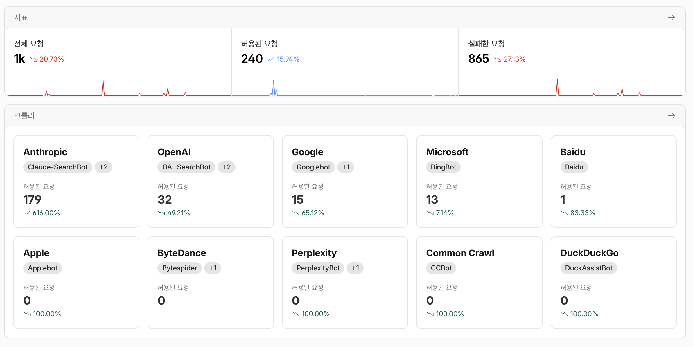
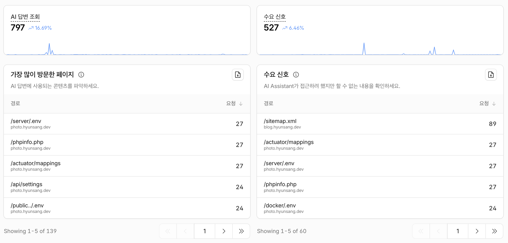
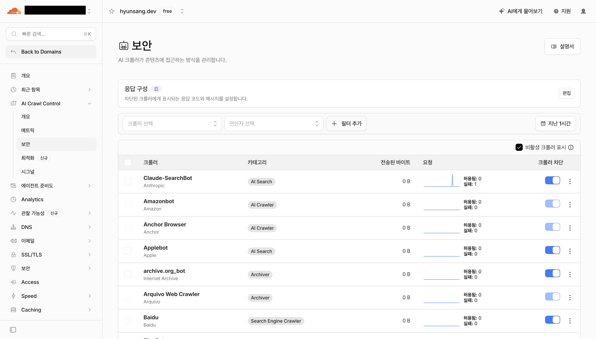
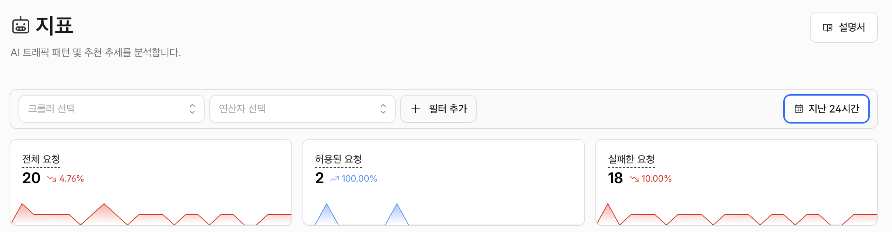

안녕하세요. 박현상입니다.  
최근 오랜만에 제가 사용하고 있는 Cloudflare에 접속하니 AI Agent들의 접속현황과 함께 로그를 볼 수 있었습니다.  
이러한 로그를 확인하고, 에이전트 서비스를 막게된 이유를 설명하고자 합니다.

## 왜 막게 되었는가

Cloudflare를 확인한 결과, 에이전트 서비스 등을 이용하여 **Directory Traversal 공격**을 시행하는 경우가 많다는 점을 인지하게 되었습니다.  
GitHub 상에 이미 [file-path-traversal/SKILL.md](https://github.com/zebbern/claude-code-guide/blob/main/skills/file-path-traversal/SKILL.md)와 같은 파일들이 많습니다. 스킬들을 통해서 Claude Code, Codex 등과 같은 에이전트 서비스를 이용하여 타인이 운영하고 있는 사이트를 공격하는 것으로 추측되고 있습니다.  
본 블로그 사이트는 이전에 이미 `robots.txt`를 작성하여 에이전트 서비스의 접근을 막고 있었습니다. 하지만 `robots.txt`를 작성하였음에도 이러한 규칙을 위반하여 에이전트 서비스 등을 이용하여 무단으로 블로그 내 정보를 사용하거나 Directory Traversal 공격을 하는 경우가 있었습니다.

다행스러운 부분은 제가 운영한 서비스는 대부분 프론트엔드만 사용하여 배포하고 있습니다. 만약 백엔드 서비스를 운영하였다면 이러한 공격에 취약점이 있었다면 공격 당하지 않았을까라는 생각을 하고 있습니다.

## 어떻게 막을 수 있는가

Cloudflare 기능을 통해서 에이전트 서비스의 크롤링을 차단을 할 수 있습니다.  

저는 대부분의 에이전트 서빗의 크롤링을 차단하였습니다. SearchBot 관련된 항목들은 몇 개의 항목들은 제한을 해제해 두었습니다. og(Open Graph Protocol) 태그 등을 유지하기 위해서는 어느 정도의 크롤러들이 필요하다고 생각되어서 검색 사이트의 크롤러들은 차단하지 않았습니다.  
대부분의 공격행위를 하는 에이전트 서비스는 ChatGPT와 Claude 등이었습니다.  

또한 `robots.txt`를 추가하여 기본적으로 모든 크롤러들에 대하여 접근에 대한 제한을 주기도 하였습니다.  
하지만 이러한 `robots.txt`를 추가하여 크롤러들에게 접근 제한을 주기도 하였지만, 이러한 제한 사항을 위반하고 페이지에 접근하는 사례도 알 수 있있었습니다.  

대부분의 크롤러들은 차단되어서 페이지에 접근하지 못하게 되었습니다.  
아직까지는 데이터가 많이 쌓이지 않아서 추후에 이러한 내용에 대해 확인하여 추가하도록 하겠습니다.  

## 끝으로

이번 내용을 살펴보면서 Claude Code와 Codex를 이용하여 악성행위를 하여 타인에게 피해를 줄 수 있는 행위를 하는 경우가 많다는 점을 알게 되었습니다.  
[‘AI 해킹’ 의심 공격에 5대 은행 노출…금융위 은행·카드사에 점검지시](https://v.daum.net/v/20261003115945979)를 보면서 우리 삶의 일부가 되어버린 인공지능 기술이 몇몇 사람들의 악의적인 행위로 인해서 타인의 개인정보 침해되지 않는지에 대한 생각이 듭니다. 또한 앞으로 "보안"이라는 분야가 얼마나 사회적으로 대두되는 분야가 될지에 대한 궁금증이 있습니다.  